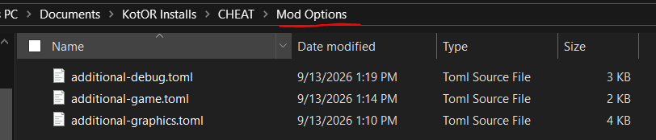
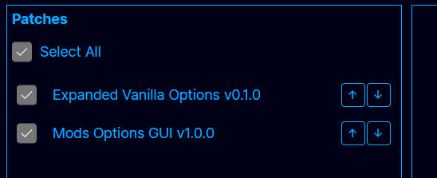
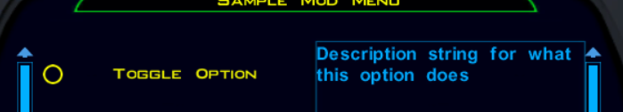
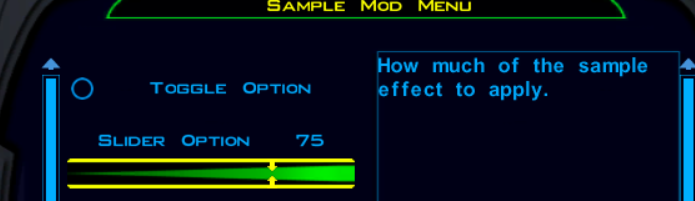
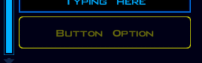

## Basic Usage and Installation

The Mod options patch ships with the Kotor Patch Manager. You can find the most recent release of the patch manager [on GitHub](https://github.com/LaneDibello/Kotor-Patch-Manager/releases).  
Currently mod options are only supported for windows versions of kotor 1.

The Mod Options patch ships with additional file, the following of which need to be placed into your game's "override" folder:

- `modoptionmenu.gui`  
- `modoptions.gui`  
- `optionsingame.gui`  
- `optionsmain.gui`

It also ships with a `sample.toml` file, which provides examples for how to create custom option configurations. For more info see "Creating an Options Menu" below.

Patches and mods that add options you want to use will ship with TOML config files. These need to be placed in a folder named 'mod options' in the game directory:  


If no TOML files are included here the menu will appear empty in game.

Ensure that both the "Mod options GUI" patch and any patches that have menus you intend to use are applied in the manager:  


Run the game by hitting the "Launch" button. You should see a button to open the mod options view on both existing options menus.

## Creating an Options Menu

Custom Mod Options are declared using a TOML file that is placed in a 'mod options' directory in the game files. The Mod Options patch ships with an additional file `sample.toml`, which serves as the template for these configs.

The `[menu]` header is where basic information about your menu is defined.
Defining a `patch` id is only necessary if the mod option needs to load an exported function from a patch; see "For Patch makers" below. The `name` and `description` fields are displayed in the menu UI.
```toml
[menu]
name = "Sample Mod Menu"
description = "Example of what custom mod menus can looks like"

# Manifest id of the patch that owns this menu.
# Default `patch` for every option below, and how their functions get resolved.
patch = "mod-options-gui"
```

Each option is defined with an `[[options]]` header. Indicating one option on the list. This allows specifying a `name`, `desscription`, `default` value, as well as the actual mechanisms of the option.

There are 5 types of options we'll cover. They are:
- `toggle`
- `slider`
- `list`
- `text`
- `button` (requires a patch to use)

Nearly every option will be paired with an `ini` config file that it reads/writes from. The `ini` file name is defined on the `ini` field, the category in the ini that this option will fall under is specified by `category`, and the actual option field name (what will appear to the left of the `=` in the ini) is specified in `key`.

Options can also be made to run a function upon use, via the `function` field. This is only possible when paired with a patch that exports a function. See "For Patch makers" below.

This is an example of a `toggle` option. These are used when you have an option that can be turned off and on (`0` being off, and `1` being on).
```toml
[[options]]
# All options needs a name
# This will be what appears in the UI
name = "Toggle Option"

# One of: `toggle`, `slider`, `list`, `text`, `button`
# toggle will supply a value of 0 or 1
type = "toggle"

# Every option needs a default value, except a `button` -- it stores nothing
default = 0

# Having an INI is optional
# but will be what most options menus do
ini = "sample.ini"
category = "Configurations"
key = "toggleOption"

# A description is optional, and is shown alongside the option
description = "Description string for what this option does"
```
In game this will appear like:


Below is an example of a `slider` option. Useful when the option is a whole number that falls between a min and max.
```toml
[[options]]
name = "Slider Option"

# slider will provide an integer between min and max.
# The game's slider control has no minimum -- it runs 0..(max - min) internally,
# and `min` is added back on before the value is stored. `min` may therefore be
# negative, which the control on its own could not represent.
type = "slider"
min = 10
max = 100

default = 50

ini = "sample.ini"
category = "Configurations"
key = "sliderOption"
description = "How much of the sample effect to apply."
```
In game this will appear as:


Below is a `list` option. Used when an option has several different choices to pick from.
```toml
[[options]]
name = "List Option"

# list will provide the selected choice as its value
type = "list"
choices = ["A", "B", "C"]

default = "A"

ini = "sample.ini"
category = "Configurations"
key = "listOption"
description = "Which sample variant to use."
```
In game this will appear as:


Below is a `text` option. Used when we need to be able to accept any input from the user.
```toml
[[options]]
name = "Text Option"

type="text"

default="sample value"

ini = "sample.ini"
category = "Configurations"
key = "textOption"
description = "Free-form sample text."
```
In game this will appear as:


### For Mod makers
Mods alone are a bit limited in the range of capabilities they can build into a menu.

The recommended means of accessing these options for modders is to use the script extender patch. This patch ships with an `nwscript.nss` that should be used when compiling your scripts that rely on it.

The script extender defines two functions for working with `ini` files:
```c
// 801. ReadIniEntry
// Reads the value from INI config file sFilename, in sCategory
// with key sKey.
// For example:
// ReadIniEntry("swkotor.ini", "Graphics Options", "AllowWindowedMode")
// gets the current value of the AllowWindowedMode config
// Returns empty string if no entry found
string ReadIniEntry(string sFilename, string sCategory, string sKey);

// 802. WriteIniEntry
// Writes sValue in the INI config file sFilename, in sCategory
// with key sKey.
// For example:
// WriteIniEntry("1", "swkotor.ini", "Graphics Options", "AllowWindowedMode")
// enables the AllowWindowedMode setting
// If the referenced file/category/key doesn't exist, it will be created.
void WriteIniEntry(string sValue, string sFilename, string sCategory, string sKey);
```

So if you mod menu sets a value in 'sample.ini' under category "Configurations", with key "option", then it can be read in scripts via:
```c
string sOption = ReadIniEntry("sample.ini", "Configurations", "option");
```

After which you can parse the result as needed for your script logic.

### For Patch makers
Creating a patch allows for much more complex menu functionality.

The main one being the ability to have an exported function called when an option is modified.
For example this toggle option calls `SampleFunction` every time it is toggled:
```toml
[[options]]
name = "Toggle Option"
type = "toggle"
default = 0
ini = "sample.ini"
category = "Configurations"
key = "toggleOption"

# Running a function on set is also optional
# Though some mods might need this
#
# Must be an undecorated __cdecl export of the owning patch, listed in its exports.def:
#     extern "C" void __cdecl SampleFunction(const char* key, const char* value)
# key is this option's `key` (or `name` if it has no ini); value is "0"/"1" here.
# Add `patch = "other-patch-id"` to point somewhere other than [menu].
function = "SampleFunction"

description = "Description string for what this option does"
``` 

As described, the function must be exported from a patch (much in the same way we do for detour hooks) with the following signature:
```cpp
extern "C" void __cdecl SampleFunction(const char* key, const char* value);
```

Furthermore, this patch's manifest `id` field needs to match the `patch` field in the `[menu]` header.

Functions can be applied to any type of option. Including a special type called `button`, which will simply run the provided function when pressed. Note that buttons have no default or `ini` file.
```toml
[[options]]
name = "Button Option"

# button stores no value at all: it has no `default` and no ini entry, and a press
# simply runs its function. `key` is still what the handler is passed as its first
# argument (the `name` when there is no `key`); the value is always an empty string.
type = "button"

key = "buttonOption"
function = "SampleFunction"
description = "Runs the sample handler straight away."
```
In game this will appear as:


In addition to the script-extender method described in the "For Mod makers" section above, patches can also directly read the ini files. This can be done directly using any ordinary C++ plain-text file handling logic. It can also be accomplished using the GameAPI class `CExoIni`, which exposes it's own `ReadIniEntry` and `WriteIniEntry` functions that work identically to the script extender ones.

## Appendices

* [KPM GitHub Repository](https://github.com/LaneDibello/Kotor-Patch-Manager)  
* [OpenKotor Discord Server](http://discord.gg/openkotor)
* [Real Options TOMLs for reference](https://github.com/LaneDibello/Kotor-Patch-Manager/tree/master/Patches/ExpandedVanillaOptions/additional) 